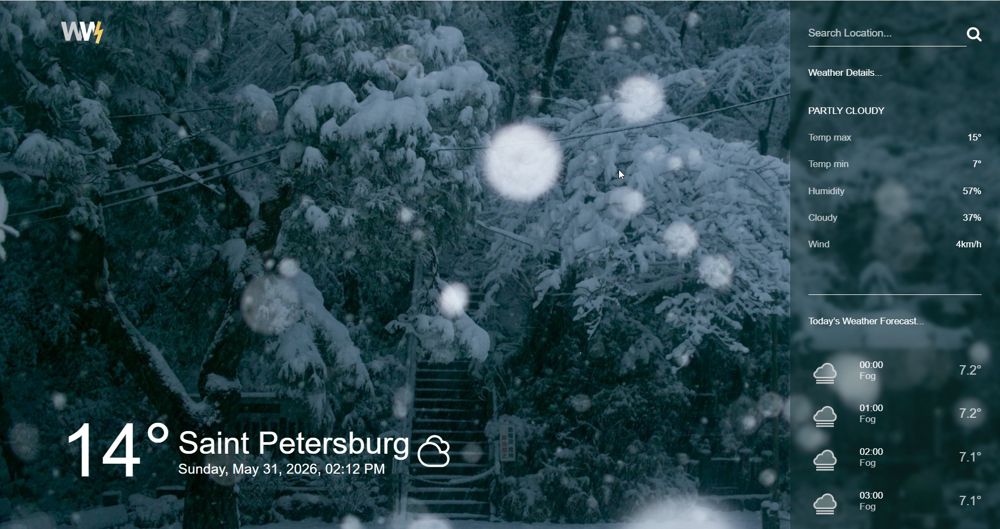

# Check the Weather
Приложение для просмотра погоды.

Пользователь может просматривать текущую погоду в выбранном городе, подробные погодные показатели и почасовой прогноз на текущий день.



## Возможности

- Показывает текущую температуру и локальную дату для выбранного города.
- Загружает погоду для Санкт-Петербурга при первом открытии страницы.
- Позволяет искать погоду по названию города.
- Отображает подробности погоды: состояние, максимальную и минимальную температуру, влажность, облачность и скорость ветра.
- Показывает почасовой прогноз на текущий день.

## Технологии

- Vue 3
- Vite
- Axios
- SCSS
- ESLint
- Prettier
- WeatherAPI

## Структура проекта

```text
src/
  assets/          Статические файлы и глобальные стили
  components/      Vue-компоненты для блоков интерфейса
  services/        API-клиент и запросы погоды
  App.vue          Основная разметка приложения и загрузка данных
  main.js          Точка входа в приложение
```

## Запуск проекта

Установить зависимости:

```sh
npm install
```

Запустить проект в режиме разработки:

```sh
npm run dev
```

Собрать проект для продакшена:

```sh
npm run build
```

Локально посмотреть продакшен-сборку:

```sh
npm run preview
```

Запустить ESLint:

```sh
npm run lint
```

Отформатировать файлы в `src/`:

```sh
npm run format
```

## API

Приложение получает данные прогноза через [WeatherAPI](https://www.weatherapi.com/). Работа с API вынесена в сервисный слой в `src/services/`.

Основные файлы:

- `src/services/baseService.js` создает экземпляр Axios.
- `src/services/weatherService.js` запрашивает прогноз для выбранного города.
